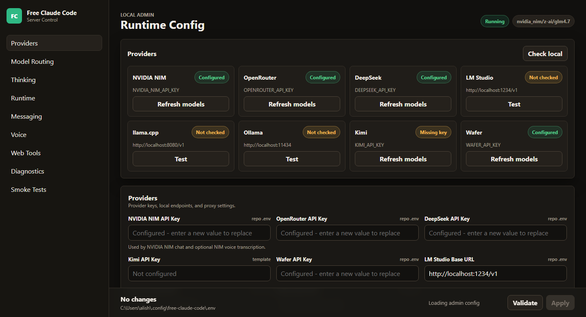
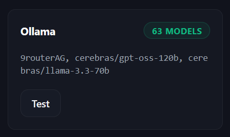
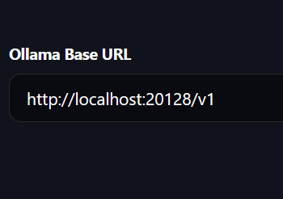

# Claude Code Gratuito e Ilimitado


> Sistema de proxy doble para ejecutar **Claude Code** de forma completamente gratuita e ilimitada, redirigiendo peticiones a más de 60 modelos de IA gratuitos disponibles en la web.

---

## Resumen

Este proyecto implementa una solución open-source que elimina las barreras económicas de las herramientas de IA para programación: costos de suscripción, límites de cuota, timeouts y falta de disponibilidad de modelos gratuitos.

Combina dos herramientas open-source:

- **[free-claude-code](https://github.com/Alishahryar1/free-claude-code)** — Proxy que intercepta las llamadas de Claude Code y las redirige a cualquier proveedor.
- **[9router](https://github.com/decolua/9router)** — Orquestador que distribuye la carga entre múltiples modelos gratuitos con rotación automática y fallbacks.

---

## Arquitectura

```
┌─────────────┐     ┌──────────────┐     ┌─────────────┐     ┌─────────────────┐
│  fcc-claude │────▶│  fcc-server  │────▶│   9router   │────▶│  Proveedores    │
│  (CLI)      │     │  (Proxy FCC) │     │ (Router)    │     │  Gratuitos      │
└─────────────┘     └──────────────┘     └─────────────┘     └─────────────────┘
      │                    │                   │
      │                    │                   ├─▶ Kiro AI (Claude 4.5, GLM-5)
      │                    │                   ├─▶ OpenCode Free (sin auth)
      │                    │                   ├─▶ Vertex AI ($300 créditos)
      │                    │                   ├─▶ Groq, DeepSeek, OpenRouter...
      │                    │                   └─▶ 60+ modelos gratuitos
      │                    │
      │              Dashboard:                Dashboard:
      │         http://localhost:8082      http://localhost:20128
      │
   El truco: fcc-server cree que habla con Ollama local,
   pero OLLAMA_BASE_URL apunta a http://localhost:20128/v1
```

### Componentes

| Componente | Rol | Puerto |
|---|---|---|
| `fcc-claude` | Interfaz CLI de Claude Code | — |
| `fcc-server` | Proxy de free-claude-code (simula Ollama) | `8082` |
| `9router` | Orquestador de modelos gratuitos | `20128` |

---

## Instalación

### 1. free-claude-code

**Windows (PowerShell):**
```powershell
irm "https://github.com/Alishahryar1/free-claude-code/blob/main/scripts/install.ps1?raw=1" | iex
```

**macOS / Linux:**
```bash
curl -fsSL "https://github.com/Alishahryar1/free-claude-code/blob/main/scripts/install.sh?raw=1" | sh
```

### 2. 9router

```bash
npm install -g 9router
```

O desde el repositorio:
```bash
git clone https://github.com/decolua/9router.git
cd 9router
npm install
npm run build
```

---

## Configuración

### Paso 1 — Iniciar 9router

```bash
9router
```

Abre el dashboard en: **http://localhost:20128/dashboard**

Conecta los proveedores gratuitos que desees (Kiro AI, OpenCode Free, Vertex AI, etc.) y crea **combos** (grupos de modelos con prioridad y fallback automático).


*Panel de proveedores de 9router. Permite conectar OAuth Providers (Claude Code, Cursor, Copilot), Free Providers (Kiro AI, iFlow, Qwen) y API Key Providers (OpenRouter, GLM, DeepSeek, etc.) desde una interfaz visual.*

### Paso 2 — Iniciar fcc-server

```bash
fcc-server
```

Abre el Admin UI en: **http://localhost:8082/admin**

| Campo | Valor |
|---|---|
| Modelo | `ollama/cualquier-modelo` |
| `OLLAMA_BASE_URL` | `http://localhost:20128/v1` |

Valida y aplica los cambios.




*Admin UI de free-claude-code. Aquí se configura el proxy para simular un servidor Ollama local, apuntando `OLLAMA_BASE_URL` a 9router. Se pueden conectar múltiples backends: NVIDIA NIM, OpenRouter, DeepSeek, LM Studio, llama.cpp, Ollama, Kimi y Wafer.*

### Paso 3 — Ejecutar Claude Code

```bash
fcc-claude
```

Claude Code funcionará de forma transparente, sin percatarse de que las peticiones están siendo redirigidas a modelos gratuitos.

---

## Flujo de Datos

1. El usuario ejecuta `fcc-claude` en la terminal.
2. Claude Code envía peticiones a `fcc-server` (su proxy configurado).
3. `fcc-server` recibe la petición y la reenvía a la URL configurada para Ollama.
4. Esa URL apunta a **9router**, que recibe la petición en formato OpenAI.
5. **9router** selecciona un modelo gratuito disponible según su configuración de combos.
6. La respuesta del modelo viaja de vuelta por el mismo camino.
7. Claude Code procesa la respuesta y continúa su ejecución.

---

## Proveedores Gratuitos Soportados

| Proveedor | Modelos | Requisitos |
|---|---|---|
| **Kiro AI** | Claude 4.5, GLM-5, MiniMax | OAuth (AWS Builder ID / Google / GitHub) |
| **OpenCode Free** | Auto-fetched | Sin autenticación |
| **Vertex AI** | Gemini 3 Pro, DeepSeek, GLM-5 | Cuenta GCP nueva ($300 créditos) |
| **OpenRouter** | Múltiples | API key |
| **Groq** | Múltiples | API key |
| **DeepSeek** | Múltiples | API key |

> Consulta el [README de 9router](https://github.com/decolua/9router) para la lista completa de 40+ proveedores y 100+ modelos.

---

## Ventajas

| Aspecto | Beneficio |
|---|---|
| **Costo Cero** | Sin suscripciones de pago. Solo free tiers. |
| **Disponibilidad Ilimitada** | 60+ modelos = probabilidad mínima de quedarte sin opciones. |
| **Tolerancia a Fallos** | Si un modelo falla o da timeout, 9router pasa al siguiente automáticamente. |
| **Contexto Fresco** | Cada modelo nuevo procesa con su ventana de contexto limpia; Claude Code mantiene el contexto global del proyecto. |
| **Configuración Visual** | Ambos proxies tienen dashboards web; no requiere editar archivos de configuración manualmente. |

---

## Por Qué Funciona Bien

Claude Code realiza el trabajo pesado de planificación y descomposición de tareas:

1. Indexa el proyecto completo una sola vez.
2. Divide el trabajo en tareas unitarias pequeñas.
3. Cada tarea lleva solo el contexto específico necesario.
4. Los modelos solo ejecutan subtareas concretas.

La calidad del resultado final depende principalmente de Claude Code, no del modelo individual que ejecute cada subtarea, minimizando la variabilidad entre proveedores.

---

## Limitaciones

- **Disponibilidad de modelos**: Los free tiers pueden cambiar sus políticas con el tiempo.
- **Consistencia de estilo**: Diferentes modelos pueden dar respuestas ligeramente distintas (Claude Code mantiene la coherencia global).
- **Latencia**: La cadena de proxies añade cierta latencia, compensada por la distribución de carga.
- **Persistencia**: `fcc-server` y `9router` deben mantenerse ejecutándose. Si se caen, Claude Code deja de funcionar.

---

## Recomendaciones

1. Monitorear periódicamente los proveedores gratuitos para detectar cambios en políticas.
2. Implementar caché de respuestas para reducir llamadas repetidas.
3. Explorar nuevos proveedores gratuitos a medida que aparezcan.
4. Crear scripts de automatización para el inicio simultáneo de ambos proxies.
5. Documentar casos de uso específicos y optimizaciones en tu equipo.

---

## Repositorios Oficiales

| Proyecto | Repositorio | Stars |
|---|---|---|
| free-claude-code | [github.com/Alishahryar1/free-claude-code](https://github.com/Alishahryar1/free-claude-code) |  |
| 9router | [github.com/decolua/9router](https://github.com/decolua/9router) |  |

---

## Licencia

Este documento es una guía de integración. Consulta las licencias de cada proyecto upstream:
- [free-claude-code](https://github.com/Alishahryar1/free-claude-code) — ver repositorio oficial.
- [9router](https://github.com/decolua/9router) — ver repositorio oficial.
